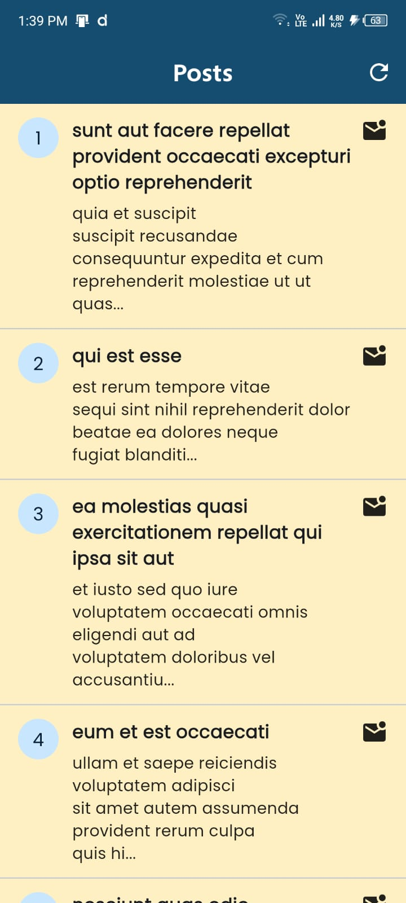
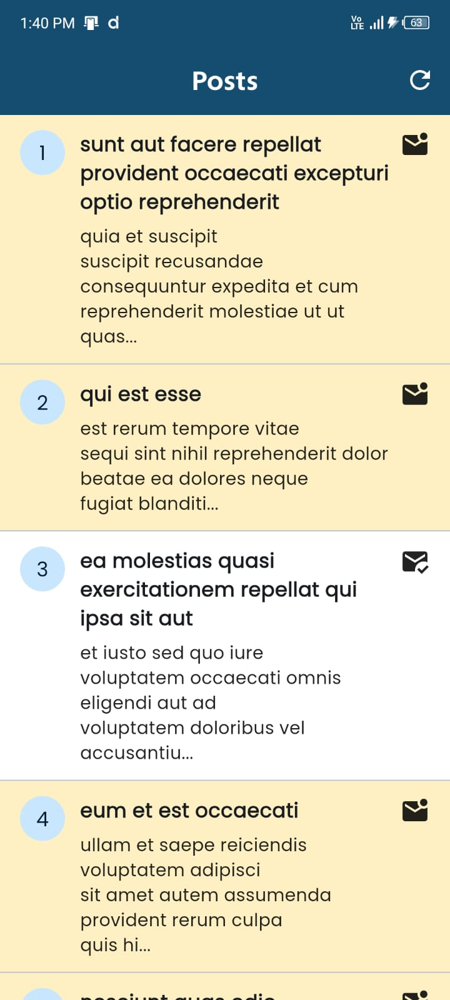
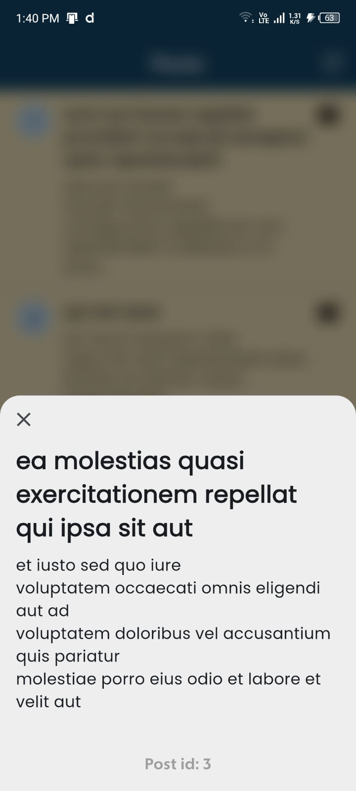

# 📱 Knovator Flutter Particle Task

A Flutter application developed for the **Knovator assignment**.  
The app fetches posts from a public API, supports local caching, and demonstrates proper architecture using **BLoC**, **Hive**, and **http**.

Apk download link : [here](https://drive.google.com/file/d/1reKnvSFiqgq-axEMJKHt67J9KfUTDpIP/view?usp=sharing)

App demo video : [Youtube link](https://youtube.com/shorts/OpUm50JtXPA)

---

## ✨ Features

- 🟡 Displays posts with a **light yellow background** for unread items
- ⚪ Changes to **white background** once marked as read
- 📄 Opens a **detail screen** showing post description (`body`)
- 🔁 **Local persistence** using Hive (loads cached data first)
- 🌐 Background API synchronization for updated data
- ⚙️ Uses **BLoC pattern** for state management
- 🚨 Handles loading & error states gracefully

---

## 🧰 Tech Stack

| Category | Library |
|-----------|----------|
| State Management | [flutter_bloc](https://pub.dev/packages/flutter_bloc) |
| Networking | [http](https://pub.dev/packages/http) |
| Local Storage | [hive](https://pub.dev/packages/hive), [hive_flutter](https://pub.dev/packages/hive_flutter) |
| Utility | [path_provider](https://pub.dev/packages/path_provider), [equatable](https://pub.dev/packages/equatable) |

---

## Screenshots

- **Home Screen**:

  

- **Home Screen 2**:

  

- **Post Screen**:

  

- **Error Screen**:

  

- **App Demo**:

  

---

## 🏗️ Project Structure

lib/
├── main.dart
├── core/
│ ├── api_client.dart
│ ├── hive_service.dart
├── data/
│ ├── models/post_model.dart
│ ├── repository/post_repository.dart
├── logic/
│ └── bloc/
│ ├── post_bloc.dart
│ ├── post_event.dart
│ └── post_state.dart
└── presentation/
├── screens/
│ ├── post_list_screen.dart
│ └── post_detail_screen.dart
└── widgets/
└── post_item.dart


---

## ⚙️ Setup Instructions

1.  **Clone this repository**
    ```bash
    git clone <your_repo_url>
    cd flutter_knovator_task
    ```

2.  **Install dependencies**
    ```bash
    flutter pub get
    ```

3.  **Run the app**
    ```bash
    flutter run
    ```

4.  **If you face any issues with Hive, clean and rebuild:**
    ```bash
    flutter clean
    flutter pub get
    flutter run
    ```

## 📦 Build Release APK

* To generate a release APK, run the following command:
    ```bash
    flutter build apk --release

* The output file can be found at:
    ```swift
    build/app/outputs/flutter-apk/app-release.apk

## 🧠 Architecture Overview

BLoC (Business Logic Component) is used to separate business logic from the UI, ensuring a clean and scalable architecture.

The Repository pattern abstracts the data layer, allowing the BLoC to request data without knowing whether it's coming from the API or the local Hive database.

Hive is used for fast and lightweight local storage (caching).

On launch, the app first loads data from the local cache for a fast startup experience, then fetches fresh data from the API silently in the background to update the cache.

## 🧪 Error & Loading Handling
Shows a progress indicator while the initial data is being fetched.

Displays meaningful error messages with a "Retry" button if the API call fails.

Background synchronization errors are handled silently and do not interrupt the user experience.

## 📝 Submission Checklist
1. [x] Working APK (public access)
2. [x] Demo video (public link)
3. [x] GitHub or GitLab repo with well-documented code
4. [x] This README file

👨## ‍💻 Developer
**Mohammad Kaif Ali**

Flutter Developer

## Contact
- **LinkedIn**: [My LinkedIn Profile](https://www.linkedin.com/in/mohammad-kaif-ali-3a19671a0)
- **Twitter**: [My Twitter/X Profile](https://x.com/kaifali744)
- **Email**: [Email me](mailto:kaifali744@gmail.com)
